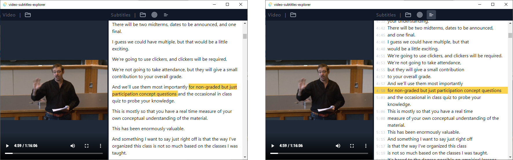

# Video Subtitles Explorer



This is a simple desktop program that displays the subtitles of a video on a sidebar.

Features:

- Display subtitles in a "paragraph" format

  (It creates a line break at the end of each sentence instead of at the end of each cue)

Todo:

- Retain state of window after closing and reopening (e.g. width of sidebar, whether the "paragraph" display mode is enabled)
- Improve splitting of cues into sentences (for use in the "paragraph" display mode)

## Build / Develop

Run development build:

```bash
cargo tauri dev
```

Build it:

```bash
cargo tauri build
```
